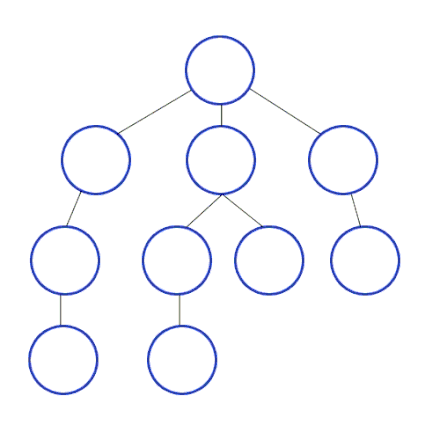

# Поиск в глубину

**Вычислительная сложность** - $O(|V|+|E|)$, где |V| - количество вершин, а |E| - количество ребер 
**Пространственная сложность** - $O(|V|)$

## Описание

Полное описание работы данного алгоритма вы сможете найти на [wikipedia](https://en.wikipedia.org/wiki/Depth-first_search)