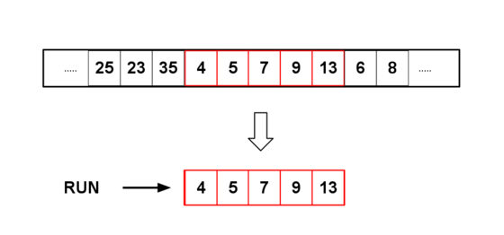

#  Timsort

## Описание
Timsort — это алгоритм сортировки, разработанный Тимом Петерсом в 2002 году. Он представляет собой гибридную сортировку, объединяющую **сортировку вставками** и **слияние**, что делает его эффективным для реальных данных.

Timsort делит массив на небольшие подмассивы ("руны"), сортирует их с помощью сортировки вставками, а затем объединяет их слиянием, используя специальную стратегию выбора рунов.

## Основные принципы работы
1. **Разделение на "руны" (runs):**
   - Алгоритм сначала ищет уже отсортированные последовательности в массиве и использует их в качестве базовых "рун".
   - Если отсортированные последовательности слишком короткие, их дополняют сортировкой вставками.
   
2. **Сортировка рунов:**
   - Каждый найденный "рун" (упорядоченная часть массива) сортируется сортировкой вставками, если он ещё не отсортирован.
   
3. **Слияние рунов:**
   - После сортировки рунов выполняется их слияние.
   - Алгоритм использует специальную эвристику (например, поддерживает баланс между размерами рунов) для выбора порядков слияния.

## Сложность алгоритма
- **Лучший случай:** `O(n)` — когда массив уже отсортирован.
- **Средний случай:** `O(n log n)`
- **Худший случай:** `O(n log n)`

Timsort работает очень эффективно с частично отсортированными данными, поэтому он используется во многих языках программирования, включая Python и Java.

## Иллюстрации работы алгоритма

### Разделение массива на руны

### Сортировка рунов
В данном случае сортировка не требуется

### Слияние рунов

(Гифка слияния рунов в процессе работы алгоритма)

## Заключение
Timsort — один из самых мощных и эффективных алгоритмов сортировки, который объединяет сильные стороны сортировки вставками и сортировки слиянием. Благодаря оптимизациям он работает быстро на реальных данных и стал стандартом для многих языков программирования.

