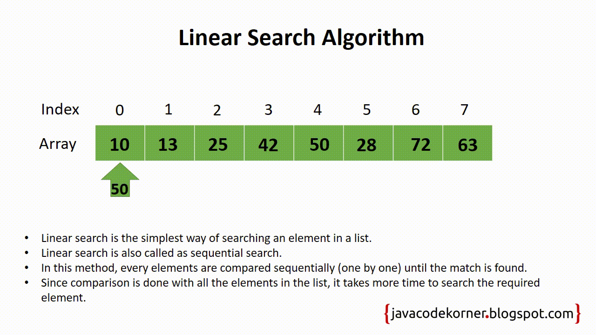

# Линейный поиск
**Вычислительная сложность** - $O(n)$ 
**Пространственная сложность** - $O(1)$

## Описание

Полное описание работы данного алгоритма вы сможете найти на [wikipedia](https://ru.wikipedia.org/wiki/Линейный_поиск)